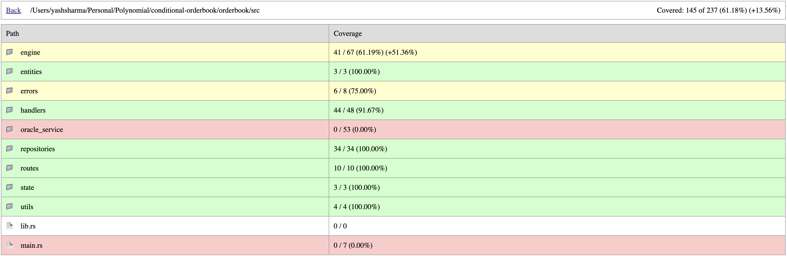

# Conditional Order Execution Service

A production-style microservice that **manages and executes conditional orders** (Option 2 of the assignment). It exposes REST endpoints to create/view/cancel orders, maintains state in a repository (in-memory by default), and runs background **matchers** per asset that execute orders when the **oracle price crosses the trigger**.

---

## Features

- **REST API**: create, get, list, cancel orders
- **Background matcher** per asset with a configurable tick interval
- **Deterministic math** using `rust_decimal::Decimal`
- **Pluggable repository** via an `OrderRepository` trait (in-memory impl included)
- **Structured tracing** with per-tick logs and summaries
- **Robust tests** covering promotions, executions, and error paths
- **One‑liner coverage** output in terminal
- **Coverage snapshot** embedded in README (see below)

---

## Architecture

```
HTTP (Actix) ──► Handlers ──► OrderRepository (trait)
                     │
                     └──► InMemoryOrderRepository (default)

OracleCache (price) ─► Matcher(s) per asset ─► Executes when price crosses trigger
```

**Matcher flow**

1. Fetch latest price `(px, ts)` from `OracleCache`.
2. Load active orders (`new | open | partially_filled`) with `OrderRepository::list`.
3. For each order:

   - If `crosses(order, px)` → set `status = filled` and log execution.
   - Else if `status = new` → promote to `open`.

Core tick logic is factored into helpers for testability:

- `collect_active_orders(asset, repo)`
- `process_active_orders(asset, repo, orders, px, ts_ms)`

---

## Running

```bash
cargo run
```

Environment variables (sensible defaults for local dev):

| Var           | Example                  | Description                             |
| ------------- | ------------------------ | --------------------------------------- |
| `ASSETS`      | `BTC/USDT,ETH/USDT`      | Comma-separated pairs to watch          |
| `TICK_MS`     | `200`                    | Matcher tick interval (ms)              |
| `SERVER_ADDR` | `127.0.0.1:8080`         | HTTP bind                               |
| `ORACLE_WS`   | `wss://example.com/feed` | Optional upstream if wiring a real feed |

---

## Coverage



---

## API

Base URL: `http://localhost:8080`

### Health

```
GET /ping
```

**200**: `pong`

### Create Order

```
POST /orders
Content-Type: application/json
```

Body:

```json
{
  "pair": "BTC/USDT",
  "side": "buy",
  "price": "100.00",
  "quantity": "1.50"
}
```

**201 Created**:

```json
{
  "id": "abc123",
  "pair": "BTC/USDT",
  "side": "buy",
  "price": "100.00",
  "quantity": "1.50",
  "status": "new",
  "created": 1700000000000,
  "updated": 1700000000000
}
```

### Get Order

```
GET /orders/{id}
```

**200**: order JSON, or **404** if not found.

### Cancel Order

```
DELETE /orders/{id}
```

**204 No Content** on success, **404** if not found.

### List Orders

```
GET /orders?pair=BTC/USDT&status=open&limit=50&offset=0
```

**200**: JSON array of orders.

---

## Example cURL

```bash
# Create
curl -sS localhost:8080/orders \
  -H 'content-type: application/json' \
  -d '{"pair":"BTC/USDT","side":"buy","price":"100.00","quantity":"1"}' | jq

# List
curl -sS 'localhost:8080/orders?pair=BTC/USDT&status=new' | jq

# Get
curl -sS localhost:8080/orders/<order_id> | jq

# Cancel
curl -i -X DELETE localhost:8080/orders/<order_id>
```

---

## Design Decisions

- Fixed‑point arithmetic via `rust_decimal::Decimal` to avoid float precision issues.
- Trait‑driven repository so persistence can be swapped (e.g., Postgres/Redis) without touching business logic.
- Extracted matcher helpers for determinism and high test coverage.

---

## TODO for future

- Idempotency (`client_order_id`, `Idempotency-Key`)
- Cursor pagination for engine scans
- Prometheus metrics for orders and latency
- Persistent repo (Redis/Postgres) & graceful shutdown
- OpenAPI/Swagger docs

---
